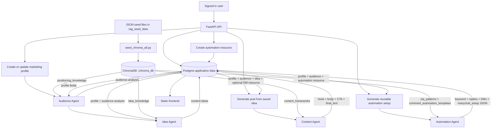
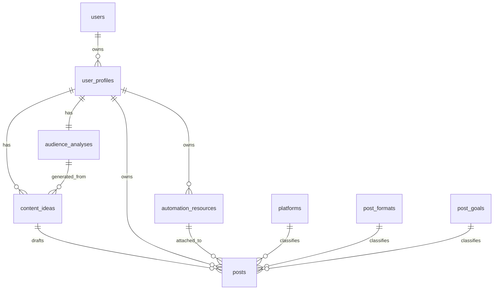

# MarketingAssistant: Agents, Chroma, And Postgres

## Simple System Diagram

## What Is Going On

The app is a FastAPI backend with a static frontend. Users authenticate, create marketing profiles, then the backend generates marketing assets through four LangChain agents.

Postgres is the source of truth for user-owned data:

- Users and auth data.
- Marketing profiles.
- Generated audience analyses.
- Generated or manually created content ideas.
- Generated posts.
- Reusable Instagram DM automation resources and their ManyChat setup JSON.

ChromaDB is the source of reusable marketing knowledge:

- It is stored locally at `./chroma_db`.
- It is seeded from editable JSON files in `rag_seed_data/`.
- It does not store per-user generated profile/post data in this codebase.
- Agents query Chroma at generation time and inject the returned knowledge snippets into their prompts.

The main lifecycle is:

1. User creates a profile.
2. Backend saves the profile in Postgres.
3. Audience Agent analyzes the profile using `positioning_knowledge` from Chroma.
4. Backend saves audience analysis in Postgres.
5. Idea Agent generates initial ideas using the saved profile, saved audience analysis, and `idea_knowledge` from Chroma.
6. Backend saves ideas in Postgres.
7. User picks an idea and asks for a post.
8. Content Agent joins profile + audience + idea + request options, retrieves `content_frameworks`, writes a post, and saves it in Postgres.
9. User can create a reusable automation resource.
10. Automation Agent joins profile + audience + automation resource, retrieves CTA and automation templates from Chroma, generates ManyChat-style setup, and saves it back to the automation resource.

## Agent Data Requirements

| Agent | Triggered by | Required Postgres data | Request/user data | Chroma collection(s) | Output saved to Postgres |
| --- | --- | --- | --- | --- | --- |
| Audience Agent | `POST /user-profiles`, `PUT /user-profiles/{profile_id}` | New or updated `user_profiles` row | `profile_name`, `niche`, `offer`, `target_audience`, `expertise`, `personal_touch`, `market_scope`, `primary_market`, `currency`, `locale_notes`, `tone`, `goal` | `positioning_knowledge` | `audience_analyses`: audience profile, pains, desires, objections, trigger moments, proof points, audience language, market context, content angles, tone, positioning, known_for |
| Idea Agent | After profile creation/update, `/content-ideas/generate-more`, `/content-ideas/regenerate` | `user_profiles` + latest `audience_analyses` | `count`; optional `trend_context` | `idea_knowledge` | `content_ideas`: title, hook, post_format, angle, topic, trend_context |
| Content Agent | `POST /posts` | `user_profiles` + `audience_analyses` + selected `content_ideas`; optional `automation_resources` | `content_idea_id`, `platform`, `instagram_content_type`, `post_goal`, `post_length`, optional `automation_resource_id`, optional `extra_context` | `content_frameworks` | `posts`: hook, body, CTA, final_text, platform, post format, post goal, Instagram type, length, optional automation resource link |
| Content Revision Agent | `POST /posts/{post_id}/revise` | Existing `posts` row joined to profile, audience, platform, goal, optional automation resource | Revision instruction | None in current implementation | Updated post hook, body, CTA, final_text |
| Automation Agent | `/automation-resources/{id}/generate-automation`, `/automation-resources/regenerate-automations` | `user_profiles` + `audience_analyses` + selected `automation_resources` | None beyond selected resource/profile | `cta_patterns`, `comment_automation_templates` | `automation_resources`: suggested_keyword, trigger_type, public_comment_reply, delivery_message, second_dm_message, button labels, qualification question, follow_up_cta, manychat_setup JSON |

## Chroma Collections

| Collection | Seed source | Used by | What it contributes |
| --- | --- | --- | --- |
| `positioning_knowledge` | `rag_seed_data/positioning_knowledge/*.json` | Audience Agent | Positioning formulas, audience research patterns, niche examples, pains/desires/objections guidance |
| `idea_knowledge` | `rag_seed_data/idea_knowledge.json` | Idea Agent | Hook patterns, idea angles, content psychology, trend-aware idea generation guidance |
| `content_frameworks` | `rag_seed_data/content_frameworks.json` | Content Agent | LinkedIn and Instagram structures, carousel/story/reel formats, post length guidance |
| `cta_patterns` | `rag_seed_data/cta_patterns.json` | Automation Agent | CTA strategies, DM keyword guidance, save/share/follow/download/book/buy patterns |
| `comment_automation_templates` | `rag_seed_data/comment_automation_templates.json` | Automation Agent | ManyChat-style trigger flows, public replies, DM opening messages, follow-up templates |

## Postgres Tables In The Agent Flow

## Key Notes

- Profile creation is not just a database write. It immediately runs Audience Agent, saves the audience analysis, runs Idea Agent, and saves 20 ideas.
- Updating a profile regenerates the audience analysis and ideas. Non-favorite ideas are deleted first; favorite ideas are preserved.
- Generating a post starts from `content_idea_id`. The backend reconstructs the full context by joining content idea, profile, and audience analysis.
- Automation resources are reusable. They can exist before a post, can be generated into a ManyChat-style setup, and can be attached later to Instagram reel/carousel post generation.
- If an automation resource is attached to a post, the backend forces the generated CTA to include the saved keyword when needed.
- Chroma data must be seeded separately with `python scripts/seed_chroma_all.py` or the agents will have little/no retrieved knowledge.
